<div align="center">

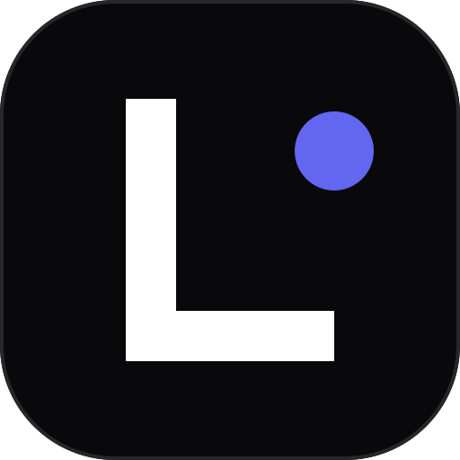

# LifeOS

### The Unified Personal Operating System for High-Performance Living
*Material 3 Expressive · Android 17 Ambient Intelligence · Gemini AI Core · 120 FPS Fluid Engine · 100% Offline-First*

<br />

[-3B82F6?style=for-the-badge&logo=android&logoColor=white)](https://lifeos-gujjeti-avineeshs-projects.vercel.app/download)
[](https://m3.material.io/)
[](https://developer.android.com/)
[](https://deepmind.google/technologies/gemini/)
[](https://lifeos-gujjeti-avineeshs-projects.vercel.app/)
[](LICENSE)

<br />

[📲 **Download Release APK (v2.1.3)**](https://lifeos-gujjeti-avineeshs-projects.vercel.app/LifeOS.apk) &nbsp;•&nbsp; 
[🌐 **Live Showcase Website**](https://lifeos-gujjeti-avineeshs-projects.vercel.app/download) &nbsp;•&nbsp; 
[⚡ **Launch Web App**](https://lifeos-gujjeti-avineeshs-projects.vercel.app/) &nbsp;•&nbsp; 
[📋 **View Release Manifest**](public/version.json)

<br />

</div>

---

## 📱 Visual Interface Showcase

Experience the native Material 3 Expressive shape scale, dynamic ambient lighting, and high-density mobile interface designed for flagship Android viewports.

| 🏠 Home Intelligence | 🏋️ Hypertrophy Gym Tracker | 📖 Deep Focus Study Hub | 🥗 Nutrition & Macros |
|:---:|:---:|:---:|:---:|
| 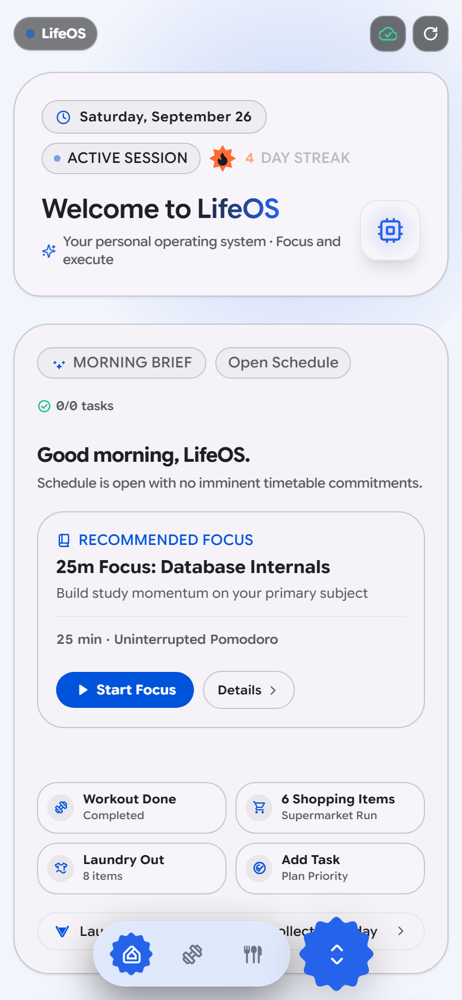 | 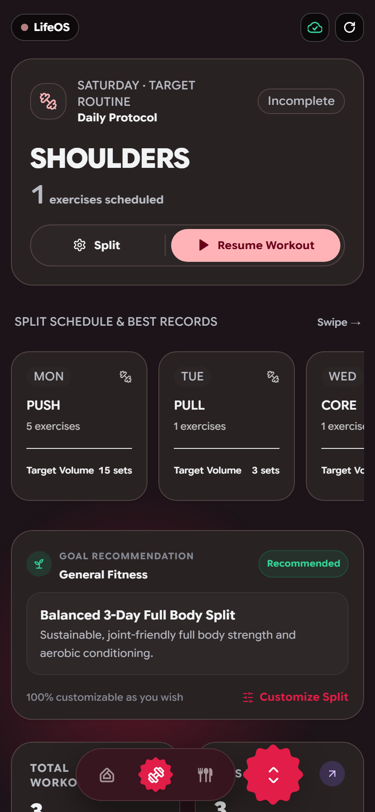 | 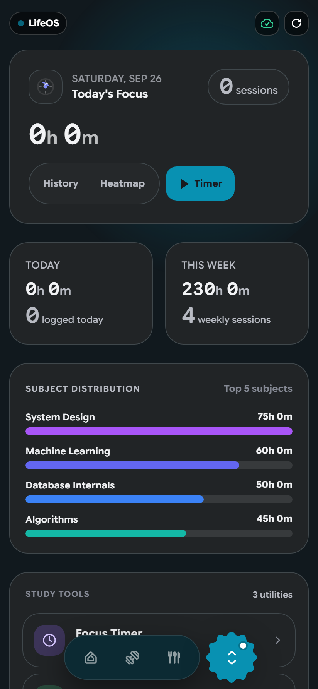 | 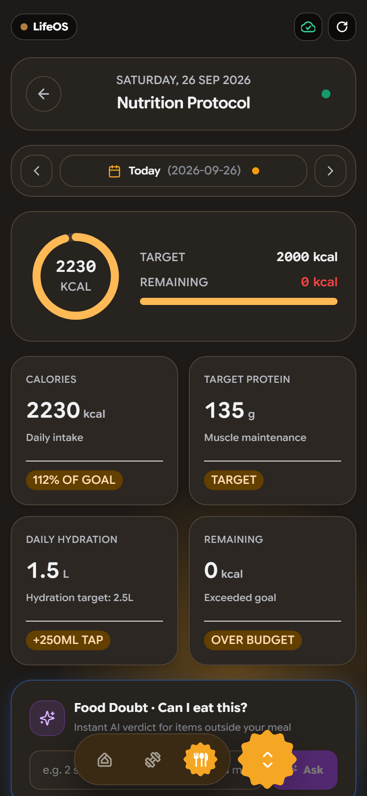 |

| 💳 Budget & Spending | 🔐 Biometric Vault | 📝 Notes & Scratchpad | 📅 Class Timetable |
|:---:|:---:|:---:|:---:|
| 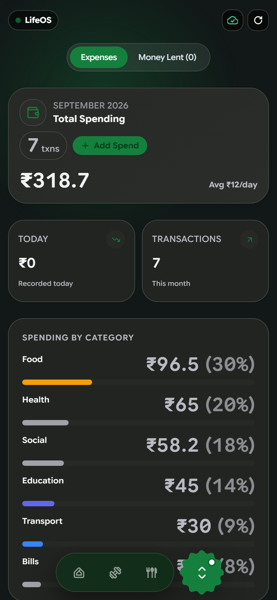 | 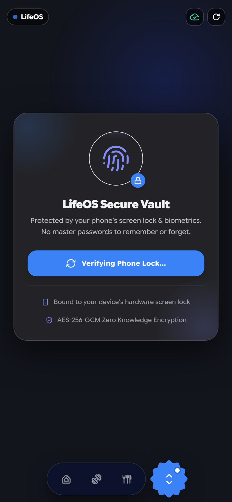 | 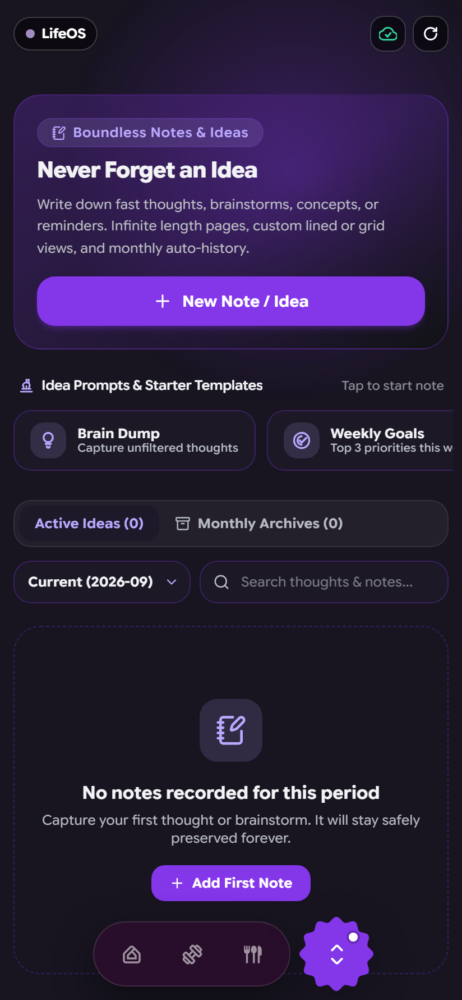 | 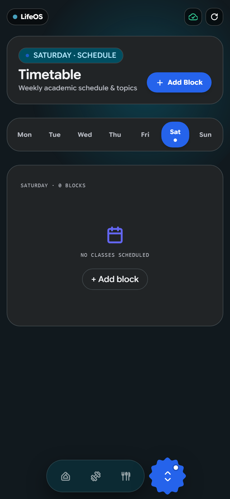 |

| 🧺 Laundry Cycle Monitor | ✈️ Outings & Trips | 🎨 M3 Color Customizer | ☀️ Adaptive Light Theme |
|:---:|:---:|:---:|:---:|
| 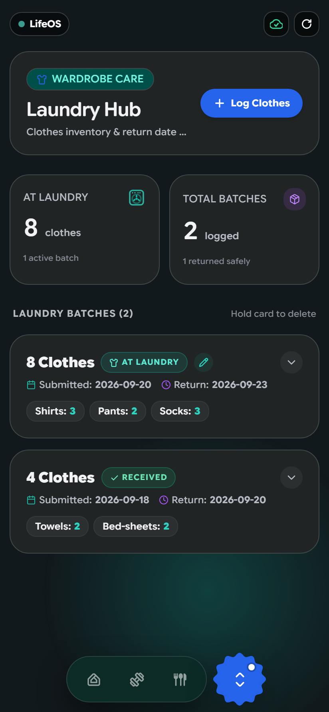 | 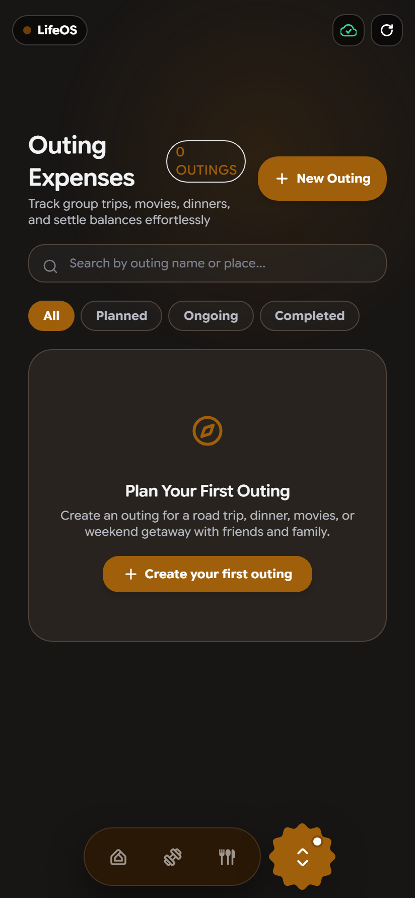 | 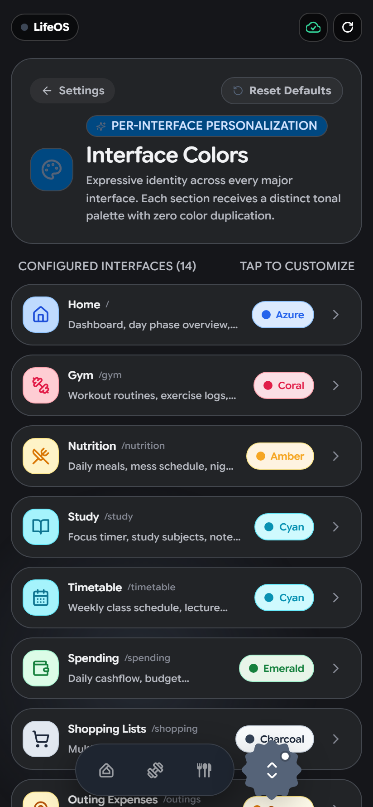 | 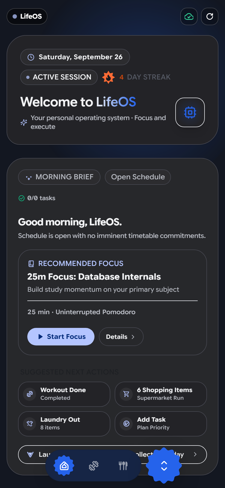 |

---

## ⚡ Executive Summary

High-performing students, athletes, and builders consistently suffer from **subscription fatigue** and context switching across 6+ disparate utilities:
- Gym tracker & workout loggers ($10/mo)
- Study timers & Pomodoro trackers ($5/mo)
- Calorie counters & macronutrient loggers ($12/mo)
- Expense managers & shared bill splitters ($6/mo)
- Password keepers & secure vaults ($4/mo)
- Campus timetable and task trackers ($5/mo)

**LifeOS** unifies your entire daily execution cycle into one cohesive, offline-first operating system. Built with **React 18**, **TypeScript 5.5**, **Tailwind CSS**, and **Capacitor 8**, LifeOS compiles into a hardware-accelerated Android APK with native biometrics, 120 FPS fluid animations, circadian color science, home screen widgets, and zero paywalls or telemetry.

---

## 🌟 What's New in v2.1.3 (Build 37)

* **Instant Zero-Friction Cold Start**: Permanently removed startup greeting screens and splash barriers to guarantee instant 0ms app boot directly to your primary dashboard.
* **120 FPS Wavy Progress Indicator**: Rebuilt in-app download and audio progress indicators with hardware vector stenciling and smooth 4-quarter continuous sine waves, delivering stutter-free 120 FPS animations on flagship displays.
* **Material 3 Expressive Design System**: Upgraded to Google's Material 3 Expressive specification, introducing scalloped action chips, divided navigation pills, and high-contrast surface elevations.
* **Android 17 Ambient Intelligence**: Real-time context system bar displaying connection status, cryptographic integrity, battery optimization, and on-device processing guarantees.
* **Interactive Gemini AI Core Sandbox**: Integrated conversational intelligence helper capable of generating custom workout splits, optimized study agendas, and macro targets.
* **Autonomous In-App Updater**: Direct sideload updater client powered by edge CDN streaming, SHA-256 cryptographic verification, and Android `PackageInstaller` sessions.

---

## 🏛️ Comprehensive 14-Module Architecture

### 1. 🏠 Home Intelligence Engine
* **Unified Lifestyle Feed**: Live status indicators, daily priority tallies, and logged focus minutes.
* **Circadian Day Phases**: Dynamically transitions through Dawn, Morning, Afternoon, Dusk, Evening, and Night based on device wall-clock time.
* **Glanceable Widget Bridge**: Native Android AppWidget synchronization rendering real-time statistics directly to the home screen.

### 2. 📖 Deep Focus Study Hub
* **Hardware-Synced Stopwatch**: Persistent wall-clock time tracking immune to device sleep, app suspension, or low-memory kills.
* **Foreground Service Bridge**: Android foreground notification showing real-time elapsed focus duration with quick action controls.
* **365-Day Consistency Matrix**: Visual density heatmap mapping continuous study streaks and milestones.

### 3. 🏋️ Hypertrophy Gym Tracker
* **Routine Architect**: Push/Pull/Legs, Upper/Lower, and custom training split configuration.
* **Live Set Logger**: Weight, rep, and RPE recording with automatic rest interval countdowns and haptic pulses.
* **Progressive Overload Analytics**: Automated 1RM calculation (Brzycki formula) and volume per muscle group.

### 4. 🥗 Nutrition & Macronutrient Tracker
* **Precision Macro Engine**: Tracks protein, carbohydrates, fats, and total daily caloric targets.
* **Campus Mess Integration**: Pre-loaded dining hall menus with 1-tap consumption logging.
* **Quick Log Vault**: Record custom food entries with instant macro-split analysis.

### 5. 💳 Frictionless Spending & Budgeting
* **Instant Expense Ledger**: Minimal-tap personal expense entry categorized across Academics, Food, Gym, Travel, and Misc.
* **Threshold Guardrails**: Dynamic progress rings providing early warnings when approaching monthly expenditure caps.
* **Exportable Accounting**: Complete historical financial exports in clean tabular formats.

### 6. 🔐 Biometric Hardware Vault
* **Android Jetpack Biometrics**: Hardware-backed authentication utilizing fingerprint scanners, facial unlock, and device PIN fallback.
* **AES-256-GCM Encryption**: Client-side cryptography with PBKDF2 key derivation for confidential keys, student portals, and recovery credentials.
* **Auto-Lock Security**: Configurable timeout triggers when the app is placed in the background.

### 7. 📅 Dynamic Class Timetable
* **Live Lecture Tracker**: Automatically highlights current and upcoming lectures based on real-time schedule hours.
* **Location Context**: Displays lecture halls, lab complexes, and professor contacts.
* **Proactive Reminders**: Scheduled notifications dispatched ahead of upcoming lecture periods.

### 8. ✅ Priority Tasks & To-Dos
* **Tonal Checklists**: Material 3 expressive task cards with priority badges, deadlines, and project tags.
* **Micro-Haptic Feedback**: Satisfying tactile responses on task completion.

### 9. 📝 Notes & Markdown Scratchpad
* **Distraction-Free Editor**: Dual-mode lined notebook paper and clean markdown document views.
* **Instant Search**: Blazing-fast client-side indexing across all saved memos and lecture insights.

### 10. 🛒 Smart Shopping Lists
* **Organized Categorization**: Grocery, apparel, hardware, and campus supplies sorted logically.
* **1-Tap Checkout Workflow**: Interactive checkboxes with instant completed-item archiving.

### 11. ✈️ Outings & Group Trip Splitter
* **Roster Management**: Manage participant rosters, itineraries, and trip budgets.
* **Automated Debt Settlement**: Real-time net balance optimization resolving who owes whom with single-tap clipboard recap generation.

### 12. 🧺 Hostel Laundry Monitor
* **Batch Lifecycle Tracker**: Monitor handover dates, batch weight, and projected collection times.
* **Itemized Inventory**: Categorize garments, bedding, and delicates to prevent misplaced belongings.

### 13. 💼 Career & Work Timeline
* **Milestone Documentation**: Record internships, research papers, project completions, and employment achievements chronologically.

### 14. 🎨 M3 Expressive Dynamic Themes
* **Tonal Color Families**: Pick from curated Material 3 palettes (Sapphire, Emerald, Rose, Amber, Obsidian, Violet).
* **True AMOLED Dark Mode**: Zero-power pure black surfaces complemented by a crisp, high-contrast light theme.

---

## 🛠️ System Architecture

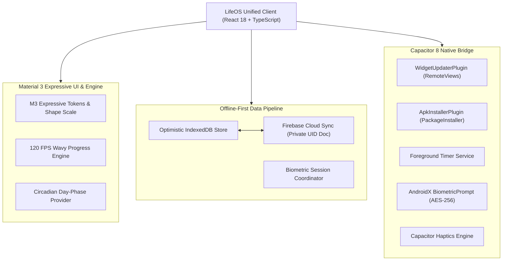

---

## 💻 Technology Stack

| Layer | Technology | Details |
|---|---|---|
| **Core Framework** | React 18.3 | Concurrent rendering, custom hooks, zero layout shift |
| **Language** | TypeScript 5.5 | Strictly typed interfaces, domain models, and zero `any` policy |
| **Styling & Design** | Tailwind CSS 3.4 | Custom Material 3 Expressive tokens & CSS variables |
| **Typography** | Google Sans Flex | Adaptive variable typography with unified weight scales |
| **Animations** | Framer Motion 11 | GPU-composited 120 FPS physics-driven animations |
| **Build Tooling** | Vite 8 + Rolldown | Blazing-fast compilation and instant Hot Module Replacement |
| **Native Container** | Capacitor 8 | Modern Android runtime with type-safe custom plugins |
| **Android Layer** | Kotlin 2.0 & Java 17 | Android SDK 34+ target, AndroidX, Gradle 8.14 |
| **Cloud Database** | Google Firebase | Encrypted Cloud Firestore with offline persistence |
| **Authentication** | Firebase Auth | Google OAuth 2.0 & biometric hardware sessions |
| **Home Screen Widget** | Android AppWidget | Native RemoteViews with circadian theme synchronization |
| **Security & Crypto** | Web Crypto API | Hardware AES-256-GCM encryption with PBKDF2 |
| **Hosting & Edge** | Vercel Edge Network | Global CDN distribution for web app and APK releases |

---

## 🚀 Quickstart & Development

### Prerequisites
* **Node.js**: v18.0.0 or higher
* **npm**: v9 or higher
* **JDK**: OpenJDK 17
* **Android Studio**: Ladybug (or newer) with Android SDK 34+
* **Firebase Project**: With Authentication and Firestore configured

### 1. Clone & Install Dependencies
```bash
git clone https://github.com/Avineesh-G/LIFEOS.git
cd LIFEOS/lifeos
npm install
```

### 2. Environment Setup
Create a `.env` file in `lifeos/`:
```env
VITE_FIREBASE_API_KEY=your_api_key
VITE_FIREBASE_AUTH_DOMAIN=your_auth_domain
VITE_FIREBASE_PROJECT_ID=your_project_id
VITE_FIREBASE_STORAGE_BUCKET=your_storage_bucket
VITE_FIREBASE_MESSAGING_SENDER_ID=your_messaging_sender_id
VITE_FIREBASE_APP_ID=your_app_id
```

### 3. Launch Development Server
```bash
npm run dev
```
Open **`http://localhost:5173/`** for the web application or **`http://localhost:5173/download`** for the showcase landing page.

---

## 📦 Build & Release Tooling

| Command | Purpose |
|---|---|
| `npm run dev` | Boots local Vite server with instant HMR |
| `npm run build` | Compiles TypeScript and builds production distribution |
| `npm run check:palette` | Verifies WCAG AAA contrast and Delta E perceptual color distance |
| `npm run test:updater` | Tests version parsing, downgrade prevention, and SHA-256 verification |
| `npm run test:matrix` | Executes 1,260-point multi-viewport layout validation across all routes |
| `npm run cap:sync` | Compiles web assets and syncs to the native Android platform |

---

## 📥 Direct Android Installation (Sideloading)

1. Open your Android mobile browser and visit:  
   👉 **[https://lifeos-gujjeti-avineeshs-projects.vercel.app/download](https://lifeos-gujjeti-avineeshs-projects.vercel.app/download)**
2. Tap **Download LifeOS for Android** to download `LifeOS.apk` (14.4 MB).
3. If Android displays the standard sideload prompt (*"File might be harmful"*), tap **Download anyway**.
4. Open the APK file and select **Install** (enable *Allow from this source* in browser permissions if requested).
5. Open LifeOS and pin the **LifeOS Glanceable Widget** to your home screen!


---

## 👨‍💻 Author & Maintainer

**Gujjeti Avineesh**  
*Lead Architect, Designer & Full-Stack Engineer*

* **GitHub**: [@Avineesh-G](https://github.com/Avineesh-G)
* **Project Repository**: [https://github.com/Avineesh-G/LIFEOS](https://github.com/Avineesh-G/LIFEOS)
* **Production Web App**: [https://lifeos-gujjeti-avineeshs-projects.vercel.app](https://lifeos-gujjeti-avineeshs-projects.vercel.app)
* **Interactive Showcase**: [https://lifeos-gujjeti-avineeshs-projects.vercel.app/download](https://lifeos-gujjeti-avineeshs-projects.vercel.app/download)

---

## 📄 License

This project is licensed under the **MIT License**. You are free to inspect, customize, and build upon LifeOS with attribution. See the [LICENSE](LICENSE) file for complete terms.

<div align="center">

<br />

**Built with pride for discipline, high achievement, and daily clarity.**  
*LifeOS © 2026 Gujjeti Avineesh. All rights reserved.*

</div>
