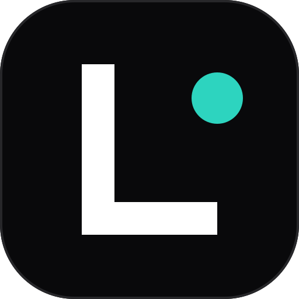
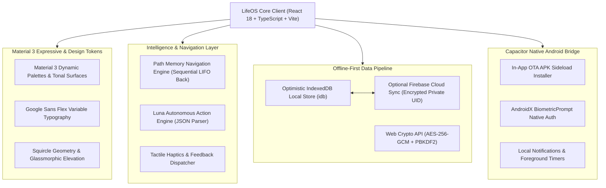

<div align="center">



# LifeOS

### The Unified Personal Operating System for High-Performance Living
*Material 3 Expressive · Google Sans Flex · Path Memory Engine · Luna AI Core · 120 FPS Fluid Motion · 100% Offline-First*

<br />

[-3B82F6?style=for-the-badge&logo=android&logoColor=white)](https://lifeos-gujjeti-avineeshs-projects.vercel.app/download)
[](https://m3.material.io/)
[](https://fonts.google.com/)
[](https://deepmind.google/technologies/gemini/)
[](https://lifeos-gujjeti-avineeshs-projects.vercel.app/)
[](LICENSE)

<br />

[📲 **Download Release APK (v3.2.5)**](https://lifeos-gujjeti-avineeshs-projects.vercel.app/LifeOS.apk) &nbsp;•&nbsp; 
[🌐 **Live Showcase Website**](https://lifeos-gujjeti-avineeshs-projects.vercel.app/download) &nbsp;•&nbsp; 
[⚡ **Launch Web App**](https://lifeos-gujjeti-avineeshs-projects.vercel.app/) &nbsp;•&nbsp; 
[📋 **View Release Manifest**](public/version.json)

<br />

</div>

---

## ⚡ Executive Overview

Modern high-performers, students, athletes, and engineers suffer from **subscription fatigue** and cognitive fragmentation across 7+ disconnected single-purpose apps:
- Workout loggers & 1RM calculators ($10/mo)
- Calorie counters & macronutrient trackers ($12/mo)
- Focus Pomodoro timers & ambient soundscapes ($5/mo)
- Spaced repetition flashcards & active recall utilities ($6/mo)
- Speech-to-text lecture transcribers ($8/mo)
- Expense managers & outing splitters ($5/mo)
- Password keepers & encrypted storage vaults ($4/mo)

**LifeOS** unifies your complete daily life management into a single, cohesive, offline-first operating system. Built with **React 18**, **TypeScript 5.5**, **Tailwind CSS**, and **Capacitor 8**, LifeOS runs seamlessly as both a blazing-fast responsive web application and a native hardware-accelerated Android app with local biometric authentication, 120 FPS animations, Google Sans Flex variable typography, and zero tracking or paywalls.

---

## 🌟 What's New in v3.2.3 (Build 61)

* **🧭 Path Memory Sequential Back Navigation**: The app memorizes your entire navigation journey step-by-step. Pressing hardware or gesture back smoothly retraces your exact path across all 30+ interfaces before triggering the double-tap exit guard.
* **✨ Universal Google Sans Flex Typography**: Integrated full-variable optical font sizing, enhanced heading letter depth (`-0.02em`), and unified typographic hierarchy across all pages.
* **📱 4-Column Squircle Navigation Hub**: Redesigned the floating bottom sheet with optimized tile geometry and multi-line label scaling, preventing any text clipping or page shifts behind device status bars.
* **🤖 Luna AI Autonomous Action Engine**: Enhanced speech-to-action parser that directly executes structured JSON actions (`ADD_TASK`, `LOG_EXPENSE`, `ADD_SHOPPING_ITEM`, `LOG_WORKOUT`) into your local storage.
* **🎯 Clean Flashcard Popups**: Replaced modal backdrops with clean transparent overlays for distraction-free flashcard creation.
* **📦 Autonomous In-App Sideload Updater**: Native OTA client that checks remote `version.json`, verifies SHA-256 cryptographic signatures, and triggers the Android `PackageInstaller`.

---

## 🏛️ Comprehensive Feature Suite

```
LifeOS Workspace
 ├── 🏠 Core Intelligence (Dashboard, Morning Briefing, Quick Actions, Daily Feed)
 ├── 🏋️ Hypertrophy Fitness (Live Set Logger, Split Architect, Muscle Volume, 1RM Engine)
 ├── 🥗 Nutrition & Fuel (Macro Rings, Water Tracker, Campus Mess Schedules, Meal Logs)
 ├── 🧠 Knowledge & Recall (Active Recall Decks, Voice Transcriber, Brain Dump HUD)
 ├── ⚡ Focus & Academics (Flow Room, Timetable Blocks, Study Timer, 365-Day Heatmap)
 ├── 💰 Finance & Life Ops (Spending Ledger, Outing Bill Splitter, Shopping Lists, Laundry)
 ├── 🔒 Privacy & Security (AES-256 Biometric Vault, Auto-Lock, Offline Storage)
 └── 🎨 Expressive Theme Engine (Material 3 Dynamic Palettes, AMOLED Pure Black)
```

### 1. 🏠 Home Intelligence Engine
* **Unified Lifestyle Feed**: Live status indicators, scheduled workout split banner, pending high-priority tasks, and daily focus duration.
* **Circadian Day Phases**: Seamlessly adapts surface lighting and greetings across Dawn, Morning, Afternoon, Dusk, Evening, and Night.
* **Daily Briefing & Quotes**: Instant 1-tap overview of today's schedule, nutrition targets, and continuous marquee motivation ticker.

### 2. 🏋️ Hypertrophy Gym & Fitness Suite
* **Live Workout HUD**: Record weights, reps, completed sets, and RPE with automatic rest-timer countdowns and haptic pulses.
* **Split Architect**: Pre-configured Push/Pull/Legs, Upper/Lower, Cardio, or fully customizable 7-day routine builder.
* **Progressive Overload Analytics**: Automated 1RM calculation (Brzycki formula) and historical exercise progression graphs.

### 3. 🥗 Nutrition & Fuel Engine
* **Macro Goal Rings**: Real-time visual tracking of Protein, Carbohydrates, Fats, and Calories with target percentages.
* **Campus Mess Schedule**: Pre-configured breakfast, lunch, snacks, dinner, and night canteen meal plans.
* **Water Glass Tracker**: Interactive visual water counter with quick increments (+250ml / +500ml).

### 4. 🧠 Knowledge, Audio & Recall Hub
* **Active Recall Engine**: Spaced repetition flashcard decks with self-rating retention algorithms.
* **Smart Voice Transcriber**: Live speech-to-text recording for lectures and meetings with instant bullet-point summarization.
* **Brain Dump HUD**: Capture unorganized thoughts and let AI categorize them into tasks, expenses, or notes.
* **Notes & Scratchpad**: Dual-view rich markdown note-taking with folder structures and instant search indexing.

### 5. ⚡ Deep Focus & Academics
* **Flow Room**: Distraction-free Pomodoro focus timer paired with ambient soundscapes (Binaural Beats, Brown Noise, Rain).
* **Dynamic Timetable**: Time-blocking schedule with auto-highlighting for the active lecture/study block.
* **Study Timer & Heatmap**: Hardware-synced study session logger with a 365-day GitHub-style consistency grid.

### 6. 💰 Finance & Life Operations
* **Spending Ledger**: Minimalist daily transaction logger with category breakdowns and monthly budget guardrails.
* **Outing & Trip Splitter**: Multi-person bill splitter calculating exact net balances and clipboard payment summaries.
* **Smart Shopping Lists**: Checklist with price estimation, item quantities, and instant completed archiving.
* **Hostel Laundry Monitor**: Cycle timers and status alerts (Washing, Drying, Ready for Pickup).

### 7. 🔒 Biometric Hardware Vault
* **Hardware Biometrics**: Protected by Android fingerprint, facial recognition, and PIN fallback.
* **Client-Side Cryptography**: AES-256-GCM encryption with PBKDF2 key derivation for confidential credentials and private notes.

---

## 🛠️ System Architecture


```mermaid
graph TD
    Client["LifeOS Core Client (React 18 + TypeScript + Vite)"]
    
    subgraph UI_SYSTEM ["Material 3 Expressive & Design Tokens"]
        M3["Material 3 Dynamic Palettes & Tonal Surfaces"]
        Typography["Google Sans Flex Variable Typography"]
        Squircle["Squircle Geometry & Glassmorphic Elevation"]
    end

    subgraph ENGINE ["Intelligence & Navigation Layer"]
        NavPath["Path Memory Navigation Engine (Sequential LIFO Back)"]
        LunaAI["Luna Autonomous Action Engine (JSON Parser)"]
        HapticsEngine["Tactile Haptics & Feedback Dispatcher"]
    end

    subgraph STORAGE ["Offline-First Data Pipeline"]
        IndexedDB["Optimistic IndexedDB Local Store (idb)"]
        CloudSync["Optional Firebase Cloud Sync (Encrypted Private UID)"]
        CryptoEngine["Web Crypto API (AES-256-GCM + PBKDF2)"]
    end

    subgraph NATIVE ["Capacitor Native Android Bridge"]
        ApkInstaller["In-App OTA APK Sideload Installer"]
        BiometricPrompt["AndroidX BiometricPrompt Native Auth"]
        CapacitorPlugins["Local Notifications & Foreground Timers"]
    end

    Client --> UI_SYSTEM
    Client --> ENGINE
    Client --> STORAGE
    Client --> NATIVE
    IndexedDB <--> CloudSync
```

---

## 💻 Technology Stack

| Layer | Technology | Details |
|---|---|---|
| **Frontend Framework** | React 18.3 | Concurrent rendering, custom hooks, zero layout shift |
| **Language** | TypeScript 5.5 | Strictly typed interfaces, domain models, and zero `any` policy |
| **Styling & Design** | Tailwind CSS 3.4 | Custom Material 3 Expressive tokens, squircle curves & CSS variables |
| **Typography** | Google Sans Flex | Variable optical sizing (`opsz`, `wght`) with crisp header tracking |
| **Iconography** | Lucide React | High-contrast vector icons exclusively (zero raw emojis in UI) |
| **Animations** | Framer Motion 11 | GPU-composited 120 FPS physics-driven spring transitions |
| **Build Tooling** | Vite 8 + Rolldown | Ultra-fast build times, code splitting, and instant HMR |
| **Native Runtime** | Capacitor 8 | Native Android wrapper with custom Kotlin/Java plugins |
| **Android Layer** | Kotlin 2.0 & Java 17 | Android SDK 34+ target, AndroidX, Gradle 8.14 |
| **Local Database** | IndexedDB (`idb`) | 100% offline-first local persistence with instant cold start |
| **Cloud Sync** | Firebase Firestore | Optional real-time multi-device cloud backup |
| **Authentication** | Firebase Auth | Google OAuth 2.0 & biometric hardware sessions |
| **Security & Crypto** | Web Crypto API | Hardware AES-256-GCM encryption with PBKDF2 salt |
| **Hosting & Edge** | Vercel Edge Network | Global CDN distribution for web app and APK releases |

---

## 🚀 Quickstart & Development

### Prerequisites
* **Node.js**: `v18.0.0` or higher
* **npm**: `v9` or higher
* **JDK**: OpenJDK 17
* **Android Studio**: Ladybug (or newer) with Android SDK 34+

### 1. Clone & Install Dependencies
```bash
git clone https://github.com/Avineesh-G/LIFEOS.git
cd LIFEOS/lifeos
npm install
```

### 2. Environment Setup (Optional for Cloud Sync)
Create a `.env` file in the `lifeos/` directory:
```env
VITE_FIREBASE_API_KEY=your_api_key
VITE_FIREBASE_AUTH_DOMAIN=your_auth_domain
VITE_FIREBASE_PROJECT_ID=your_project_id
VITE_FIREBASE_STORAGE_BUCKET=your_storage_bucket
VITE_FIREBASE_MESSAGING_SENDER_ID=your_messaging_sender_id
VITE_FIREBASE_APP_ID=your_app_id
```

### 3. Launch Development Server
```bash
npm run dev
```
Open **`http://localhost:5173/`** to view the application.

---

## 📦 Build & Release Pipeline

```bash
# 1. Compile TypeScript & Vite production bundle
npm run build

# 2. Sync web build to native Android Capacitor project
npx cap sync android

# 3. Assemble signed release APK
cd android && .\gradlew.bat assembleRelease && cd ..

# 4. Compute SHA-256 checksums & update version manifests
node scripts/prepare-release.js
```

---

## 📥 Direct Android Installation (Sideloading)

1. Visit the download landing page on your Android device:  
   👉 **[https://lifeos-gujjeti-avineeshs-projects.vercel.app/download](https://lifeos-gujjeti-avineeshs-projects.vercel.app/download)**
2. Tap **Download LifeOS for Android** to download `LifeOS.apk` (~13.8 MB).
3. If Android prompts *"File might be harmful"*, tap **Download anyway**.
4. Open the downloaded APK and tap **Install**.
5. When future updates are released, LifeOS will automatically notify you and update in-place with 1 tap.

---

## 👨‍💻 Author & Maintainer

**Gujjeti Avineesh**  
*Lead Architect, Designer & Full-Stack Engineer*

* **GitHub**: [@Avineesh-G](https://github.com/Avineesh-G)
* **Project Repository**: [https://github.com/Avineesh-G/LIFEOS](https://github.com/Avineesh-G/LIFEOS)
* **Production Web App**: [https://lifeos-gujjeti-avineeshs-projects.vercel.app](https://lifeos-gujjeti-avineeshs-projects.vercel.app)
* **Download Landing Page**: [https://lifeos-gujjeti-avineeshs-projects.vercel.app/download](https://lifeos-gujjeti-avineeshs-projects.vercel.app/download)

---

## 📄 License

This project is licensed under the **MIT License**. You are free to inspect, customize, and build upon LifeOS with attribution. See the [LICENSE](LICENSE) file for complete details.

<div align="center">

<br />

**Built with pride for discipline, relentless focus, and daily excellence.**  
*LifeOS © 2026 Gujjeti Avineesh. All rights reserved.*

</div>
